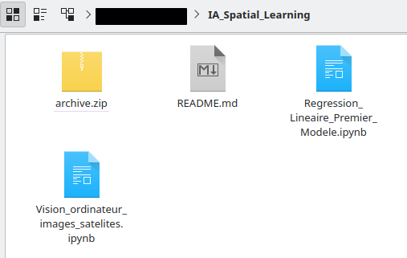

# Vision_ordinateur IA

## Description

J'ai profité de cette année pour prendre des leçons sur la vision ordinateur ou comment interpréter des images avec des programmes.

Mes sources proviennent majoritairement de Youtube. Les projets sont centrés sur l'apprentissage des concepts de base donc n'ont pas réelement de résultats particuliers.

Cependant, ce dossier comporte 2 exemples de ces projets pour donner un aperçu de ma méhode.

## REGRESSION LINEAIRE

## PREMIER PROJET DE VISION PAR ORDINATEUR

## Lancer le projet avec Jupyter Notebook :

*Il est possible que vous deviez installer un environnement.*

**Pour le projet régression linéaire**
source nom_de_votre_environement/bin/activate

jupyter notebook

**Pour le projet vision par ordinateur**
Étape 1 : Télécharger un dataset satellite comme EuroSAT

Allez sur : https://www.kaggle.com/datasets/apollo2506/eurosat-dataset

Téléchargez le dataset (vous devrez créer un compte Kaggle si ce n'est pas fait)

Décompressez le fichier ZIP dans le dossier dossier IA_Spatial_Learning

