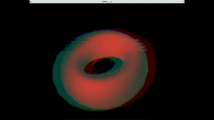
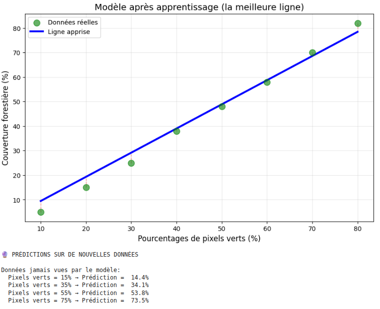

# MONMASTER2026

Ce dossier regroupe les projets cités pour les candidatures Mon Master 2026.
Pour plus de simplicité, chaque projet contient une démo vidéo et un fichier texte contenant des instructions de lancement.

## VHS FILTER OPENGL

## SHADOW MAP OPENGL

## BLUEBEARD OPENGL

## REGRESSION LINEAIRE IA

